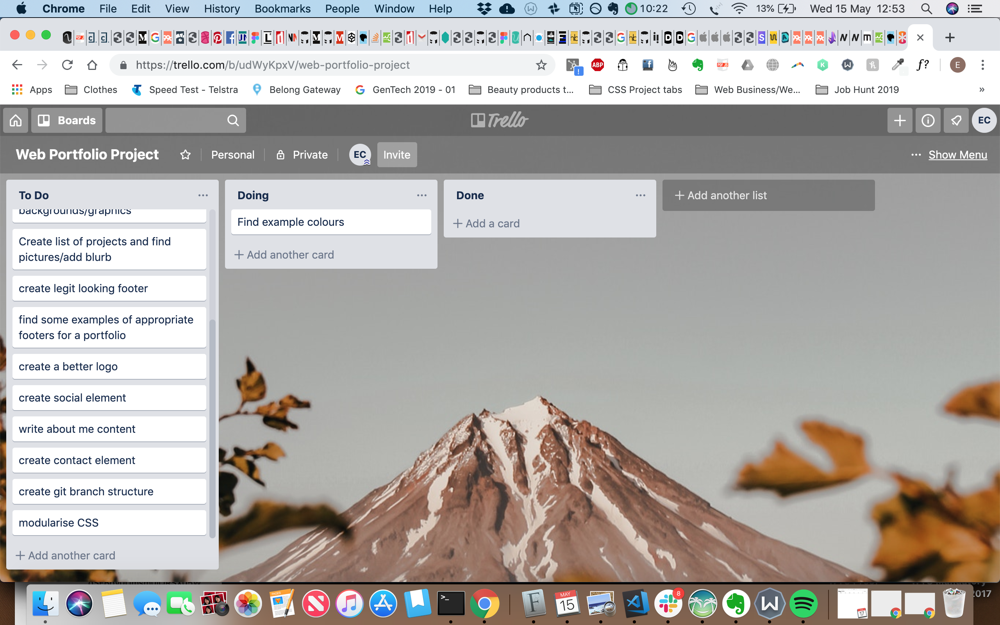

# Portfolio

**About this site**

This website is a portfolio for my Coder Academy web development bootcamp assessment. The brief was to design then deploy a well-designed and functional portfolio website.

Link to Github repository: https://github.com/mcbadger88/portfolio-web-project

Link to Trello board used for project management: https://trello.com/b/udWyKpxV/web-portfolio-project

Link to Figma used for this project: https://www.figma.com/file/cHKnQ7ZekknAIS7tkjWGTppn/Portfolio-Mood-and-Design

## Description

*Purpose*

The purpose of this website is to function as an online portfolio, displaying both my personality and technical skills/experience. The audience is Coder Academy for assessment, but also the wider tech community and potential employers. 

*Target audience*

I see the target audience as predominantly being three groups:

- Coder Academy instructors who are evaluating it as part of the assessment for the bootcamp
- potential employers.
- existing collegues and peers

While collegues and peers are part of the audience, I wanted to keep potential employers front of mind. 

For this audience of potential employers, I wanted to keep the design clean and professional. I also wanted to do something unique, which is why I settled on the unusual off-centre, interactive,layout. With the layout designed to be truly responsive, in such a way as to not need any media queries!

In order to keep the site from being jarring, I wanted to use design principles for the arrangement of the elements, and as such they all line up with various lines of the grid so that when they resize it still looks liek a design decision. I like the way that this almost computerises the act of design, by using the principle of alignment and repetition to create attractive layouts. I was inspired and influened a lot by Jan Tschichold, and her way of looking at design and how to translate it into proper use of grid.

*Functionality*

The website has four main pages
- Home (default)
- About, containing more details about me as a person
- Skills, detailing a collection of my skills and an attempt to convey varying competenies at each
- Projects, containing a few projects in order to give context and demonstrate claimed skills
- Contact, containing links to Git and Linkedin and a contact form

**Interactive:**
The background is interactive, and moves as you pass the mouse over it, and kind of guides you to scroll down. I would prefer if this happened on scroll or as an animation after hover, but unfortunately that is not possible in CSS yet. I kept the slightly glitchy hover effect as I like it and felt it makes the site feel more interesting and interactive/human.

All of the background images are clickable, and animatable, as are all the icons on the site. I intended to have the background images be project pictures and link to the relevant projects, and to have the skill icons like to relevant projects and vice versa. Unfortunately I ran out of time but the structure is there to do this quite easily. Also I would have liked to have done more with animating the background images, but again ran out of ttime/

**Responsive:**
 The site does not use any media queries, this was an initial goal and I am pleased to have achieved it. I think it lends to an interesting layout and makes it more fun to play with resizing and watching how things react, but I'm not sure if that qualifies as 'functionality', or if it's just me being lame :) The projects section in particular is pretty cool, it resizes in three different configurations automatically depending on screen size.

Desktop Layout 

ipad Layout (no media queries)

Mobile Layout (no media queries)

**background:**
The background is fixed on scrolling, which is a modern effect that I wanted to use with my site, there isnt much going on so I tried more to focus on small details. The nav icons also react on hover which ties in with the 'living' effect of the moving background.

*Tech stack*

The site is built using HTML and CSS. It is deployed using Netlify connected to a Git repo.

Screenshots of deployed site and domain:

## Design

*Design Process*

During the design process I knew I wanted geometrical shapes, and a simple design, and some combination of the colours pink and blue. I made a few mockups of what I would want the layout to look like on a desktop, also to try to get a feel for design and what looks good. 

My early attempts were too childlike for what I was after, and they led to me going for a more professional simple design in the end. But it was invaluable to spend that time playing with the designs, and it was during this process that I discovered the use of filters to tie elements together, and making things slightly transparent to appear modern, and subtle stroke/shadows to create depth of hightlight important elements. 

**fonts:**
I used the same font throughout for most of the text, but had a few different weights or styles that I defined in one place and then tried to reuse throughout in order to create consistency. There was another font used for paragraph text, I spent some time in figma deciding on the best font and font pairing. I wanted a sans serif for all headings and titles, and then a serif for proper text content, as I feel this is in keeping with web trends. I used fontjoy to generate the pairing. I used the 'what the font' browser extension a lot in order to gauge best practices from other sites.

For a few days I was using a google effect font for my header, it was a brick pattern, however it became apparent that this was not supported on iOs, and after also receieving a few negative reviews from peers saying that it resembled salami, I opted to ditch the google effect and go with a plain text with slight shadow.

Font colours were used to create content hierachy, with a slightly lighter black being used for less important content.

**Colours:**
I started with colours that I like, navy and pink, and also wanted to keep a neutral black/white theme as I felt that sites that are predominantly black/white look "understated yet competent", which was the kind of feel I wanted.
In the end I colour picked a redish colour from the google 'brick' font I was going to use, and paired it with a blue for the accent on the nav bar and matching contact image.

A filter with the site colour (brick red/pink) is placed over all images to create uniformity.

The same colours are used throughout, and can easily be changed, as they have been defined in ::root as variables. This is in keeping with the flexible and modular 'self-deisnging' site I wanted to create. In tis context, it is 'self-designing' as you can just change one of the root colours and all the elements that are associated with that will change, the elements have all been chosen to have a color that groups them together in a sensible way. So for example things that need to highlight or draw attention use the 'dark-brick' variable, whereas more blended effects or elements use 'pale-brick', or for filters and shadows.

**Images:**
Decision: I chose not to use an image of myself as it wasnt in keeping with what I wanted to convey, I find a picture of myself to be unecessary in demonstrating my competencies for a job role.

*Mock ups/Wireframes*

Early mockup, too childish, learned a lot about how to modify a font and what fonts there are:

Playing with texture, filters and svgs:

Animation created to create interactive grid, was decided too child like (and crazy):

Inspiration of interactive geometry from escher:

Existing sites that implement geometric design:

Last moodboard/font planning/nav layout design:

Final mockup before beginning coding:

*Usability Considerations*

Was sure to try to keep the HTML structured in a semantic way to aid with reading the HTML, and minimise the use of divs soley for layout purposes.

Alts were added to all images. When applying filters to images, I had to set them as background images on a div in order to be able to use this CSS functionality. I made sure to add an alt to those divs describing what the image was, so that readers would know what the div contained and not lose the experience of the site.

# Project management

*Project Plan*

I used git throughout to save working versions of the site, and could easily then push and view on my mobile via the netlify hosting. This enabled me to continuously check the site on mobile and desktop.

A trello board was set up at the beginning of the project, screenshots included below. I did not manage to get everything I initially planned for MVP done, but I did get something off the stretch list done so I am pleased with that. I had initially thought it would be a stretch goal to include animated gemoetrical shapes that could 'guide the user flow', but as I progressed with the project I realised I wanted to use this property as the basis for the design anyway, so just started to do and think about it at the same time as the other tasks.

I did not start coding until after 3 days in, this only left me with 3 days and in hindsight I would have needed longer.

*Trello Screenshots*
1st:

2nd:

3rd:

final:

  

## Assessment Questions ##

*Question 1*

Describe key events in the development of the internet from the 1980s to today

**Answer**

In the 1980s, the world realises the importance of developing networks for scientific research and personal communication. The National Science Foundation (NSF) was then the major organism in the creation and development of the NSFNET which evolved in the Internet today.

In 1981 the TCP/IP  protocol is established, this protocol carries most of the “packets” of information across the internet. 

In November 1983 the Domain Name System (DNS) is introduced to the internet, allowing quick exchange of IP addresses.

On the same month, Microsoft Word is announced.

In 1989, World Wide Web is invented by Tim Berners-Lee.

As of today, the internet is accessible almost anywhere in the world especially via the mobile phones “smartphones” present in everyone's pocket.

*Question 2*

Define and describe the relationship between fundamental aspects of the internet such as: domains, web servers, DNS, and web browsers

**Answer**

Let’s use the example of researching activities to do in Melbourne to answer this question.

In order to make a internet search, I open a Browser (e.g : Chrome) and type in the domain name of the Web browser I will use e.g: www.google.com.

My web browser will then find google’s IP address.

The web browser will have to request the IP address from the DNS server if the IP address isn’t already present in my computer’s cache

The computer is now able to send a request to see the webpage from the web server. This server will then respond to this request if it can, otherwise, an error message will be communicated.

To finish, the browser will compile all the packets of information in order to show an internet page as it should look to humans. This communication will be sent to your computers IP address 

*Question 3*

Reflect on one aspect of the development of internet technologies and how it has contributed to the world today

**Answer**

The aspect of internet technologies development I choose to reflect on is the almost unlimited access to knowledge.

In today’s world, almost every developed country citizen has access to the internet. Which means that almost anywhere, anytime in these countries, your phone, with internet access can answer most of your questions. 

There is no need to go somewhere / open a book to find an answer. No need to buy the Newspaper to read the daily news. Almost anyone can choose to read, learn, acquire more knowledge with very few limitations.

This aspect of technology place everyone on the same level, we all have access to billions of resources and can learn about everything if we decide so.